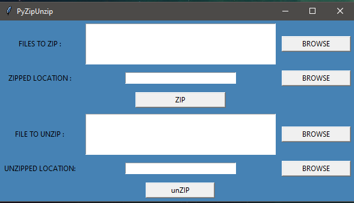

# PythonZipUnzip
-Python GUI to Zip and unZip FILES using zipfile library of python

The ZIP file format is a common archive and compression standard. This module provides tools to create, read, write, append, and list a ZIP file.

This module does not currently handle multi-disk ZIP files. It can handle ZIP files that use the ZIP64 extensions.

The zipfile module is an inbuilt module in Python

